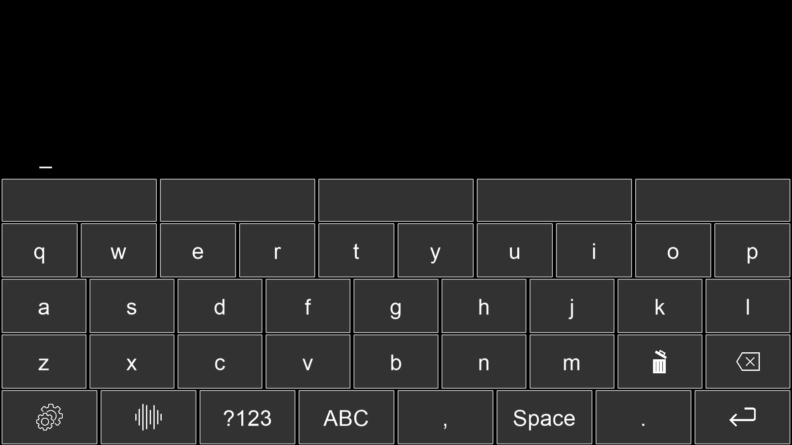

Smart BCI keyboard
============================

Introduction
------------
This module implements a keyboard for the BCI system developed by MindAffect.
   * It supports adding your own configurable keyboard from a JSON file.
   * Multiple keyboards (sub-keyboards) can be used.
   * It is to be used cross-platform (Windows, MacOS, Linux).
   * Predictive text: given the first few letters of a word,
     the user will be given the most likely options as 'keys' on the keyboard.
   * Text to speech: allows the user to say text out loud (with a 'say-out-loud' key).
   * Word correction: adds automatic correction of misspelled words with easy ability to
     undo.
Requirements
~~~~~~~~~~~~
Our keyboard implementation is based on the `mindaffectbci module
<https://pypi.org/project/mindaffectBCI/>`_ developed by `MindAffect
<https://www.mindaffect.nl/>`_ so this should be installed.

  pip install mindaffectBCI

The required packages can be found in requirements.txt and installed as follows

  pip install -r requirements.txt

We recommend using Python version at least 3.8

How to use in combination with MindAffectBCI software
~~~~~~~~~~~~~~~~~~~~~~~~~~~~~~~~~~~~~~~~~~~~~~~~~~~~~
open a command prompt and go through the following steps:
    * navigate to the smart-kyboard directory
    * If you have not already completed the steps from the Requirements section, please do so.
    * you can finish up the installation process by executing the following command:
    

        python setup.py develop

Before starting the keyboard app, the MindaffectBCI module needs to be running in the background. If you don't know how to do this, you can find a guide on the `PymindaffectBCI repository <https://github.com/mindaffect/pymindaffectBCI/tree/open_source>`_ . 
    * Now, go back to the command prompt you've opened earlier and navigate to the *keyboard* directoy. 
    * As the final step, run the following command:
    

        python bci-keyboard.py

Adding a configurable JSON keyboard
~~~~~~~~~~~~~~~~~~~~~~~~~~~~~~~~~~~
Using a `keyboard editor <http://www.keyboard-layout-editor.com/#/>`_ we can generate
custom .json files that can be read into the program. Unlike normal keyboards we only allow
one character per key, much like mobile keyboards, so no usage of shift to select a different
thing on the same key.

More information on this can be found in guide_to_creating_custom_json_keyboards.txt

Word prediction and autocompletion
~~~~~~~~~~~~~~~~~~~~~~~~~~~~~~~~~~
Our word prediction and autocompletion module implements OpenAI's
`Generative Pretrained Transformer 2 (GPT-2) <https://openai.com/blog/better-language-models/>`_
This model was trained to predict the next word in 40GB of internet text.

Word correction
~~~~~~~~~~~~~~~
Our word correction module uses the `SpellChecker <https://pypi.org/project/pyspellchecker/>`_
module which is based on Peter Norvig's `blog post <https://norvig.com/spell-correct.html>`_
on setting up a simple spell checking algorithm.

English, Spanish, German, French and Portugese were already supported by this module. Our
module allows the user to add their own language if they have a word frequency file for
this language. We also implemented the option to download such a frequency list from a 
`Git repository. <https://github.com/hermitdave/FrequencyWords>`_

Text to speech
~~~~~~~~~~~~~~
Our text-to-speech module uses the `pyttsx3 module <https://pypi.org/project/pyttsx3/>`_
which works offline and is compatible with both Python 2 and 3.
If there is a connection to the internet, Google's `gTTs <https://pypi.org/project/gTTS/>`_
will be used.

Installation
------------
Our module can be installed as follows.

.. code-block:: python
   
   import everything
   install(everything)

Problems
~~~~~~~~
First check if your Python version is not outdated and if all the required packages have
been installed correctly (see Requirements).

Add help here for possible problems that may arise with installation.

Usage
-----
Show basic usage of our module.

.. code-block:: python

   import keyboard
   print('wow look at how this works!')

Authors and acknowledgment
--------------------------
*The base keyboard module plus word completion was developed by the following group of students:*

Thomas de Lange,
Thomas Jurriaans,
Damy Hillen,
Joost Vossers,
Jort Gutter,
Florian Handke,
Stijn Boosman

*Developed in close collaboration with `MindAffect <https://www.mindaffect.nl/>`_ *

License
-------
MIT License (MIT)

Project status
--------------
Project is in development
